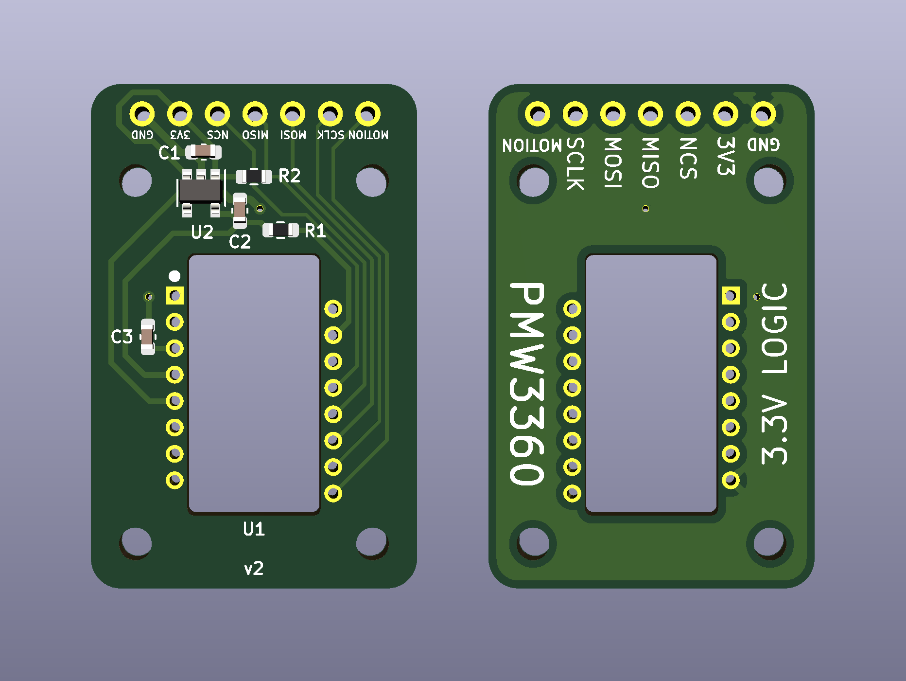

# PMW3360 breakout board

This repository contains PCB design files for a breakout board for the PMW3360 optical mouse sensor.

The board doesn't do any level shifting so it only works with 3.3V logic.

The dimensions of the board are 22x34mm and the mounting holes are for M2 screws.

The files in the [fabrication](fabrication) folder can be used to order this board from JLCPCB with SMT assembly. The board you get includes everything except the actual sensor. If some of the specific components are out of stock, try to find an equivalent with the same package and parameters.

The sensor chip should be soldered on the top side (the side where all the other components are). The dot marks pin 1. The optic goes on the bottom side.

